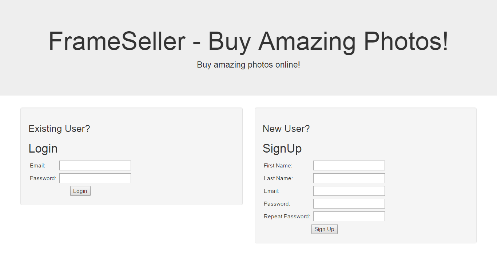
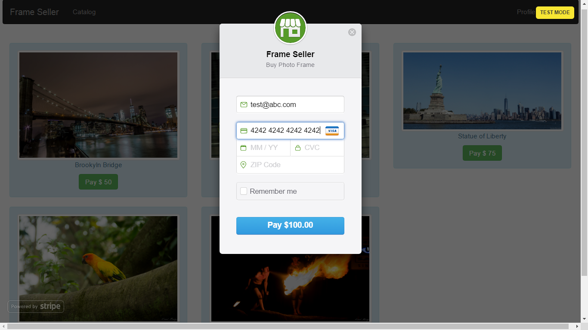
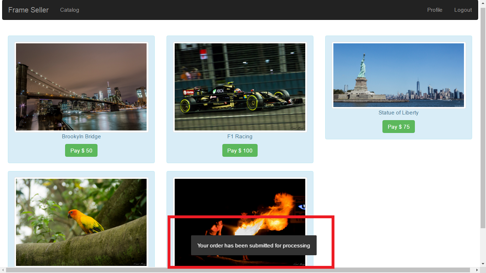

# Stripe Demo

## A Team Has No Name

### Team Members
1. Abhijeet Mehrotra
2. Akshay Nagpal
3. Kunal Baweja
4. Siddharth Shah

## Tech Stack
1. Python (Django REST Framework)
2. HTML5, CSS, Javascript
3. jQuery, Bootstrap
4. MySQL

## Deployment
1. Front end static files hosted on S3 bucket
2. Database hosted on Amazon RDS
3. Backend server hosted on Elastic Beanstalk (Load Balancer + EC2 instance)

## API endpoints
<dl>
  <dt>POST stripe_demo/api-token-auth/</dt>
  <dd>Login service</dd>
  <dt>POST stripe_demo/signup/</dt>
  <dd>Sign Up service</dd>
  <dt>GET stripe_demo/product/</dt>
  <dd>Fetch product catalog service</dd>
  <dt>GET stripe_demo/order/</dt>
  <dd>Get orders of logged in user</dd>
  <dt>POST stripe_demo/order/</dt>
  <dd>Submit order & stripe token to backend</dd>
</dl>

## Screenshots

![Catalog] (screenshots/catalog.png "Catalog")

![Orders] (screenshots/orders.png "Orders by user")
![Stripe Oder Meta] (screenshots/stripe_order_meta.png "Stripe Metadata")
