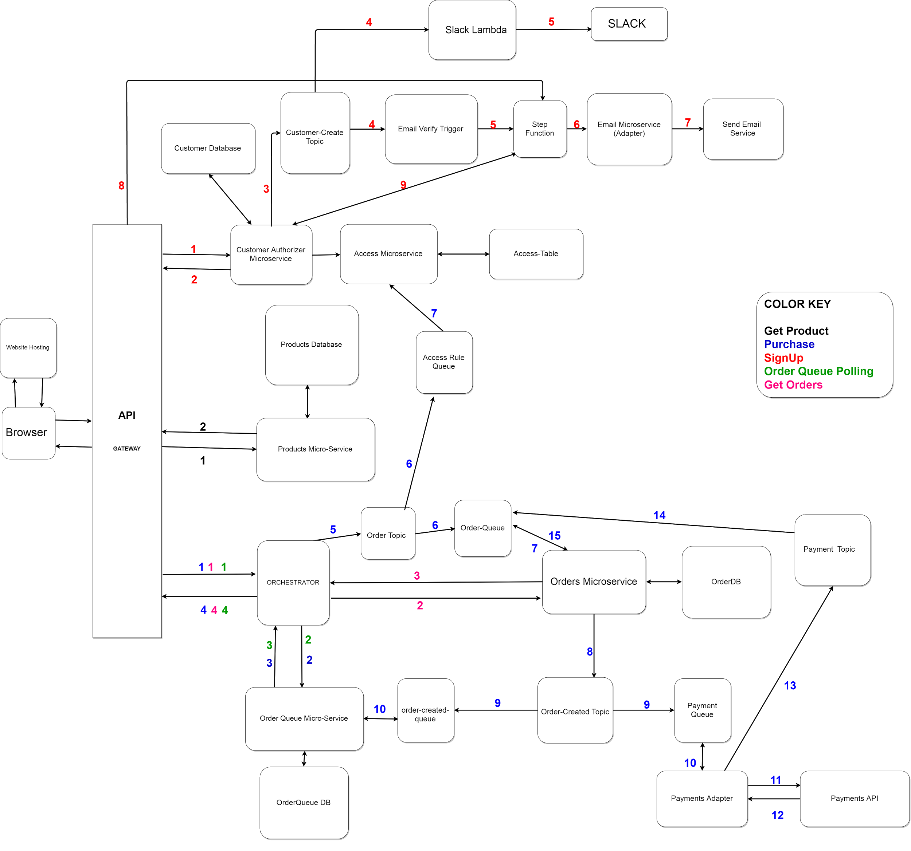
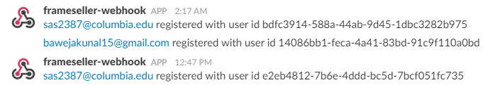
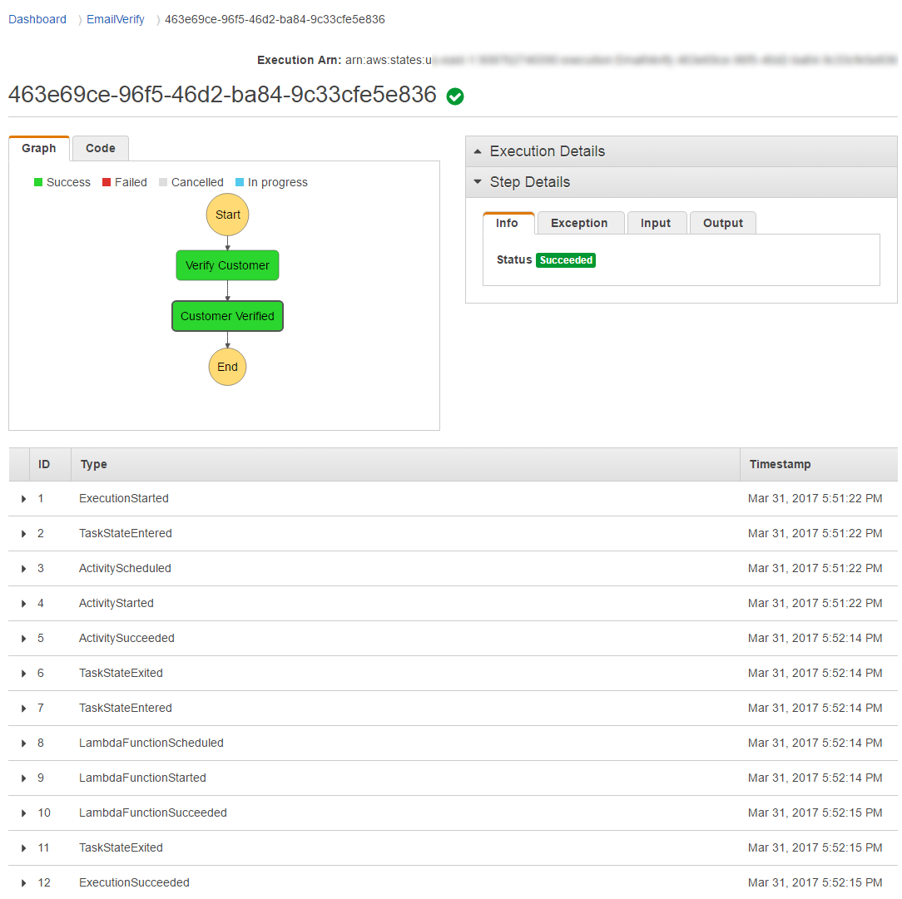
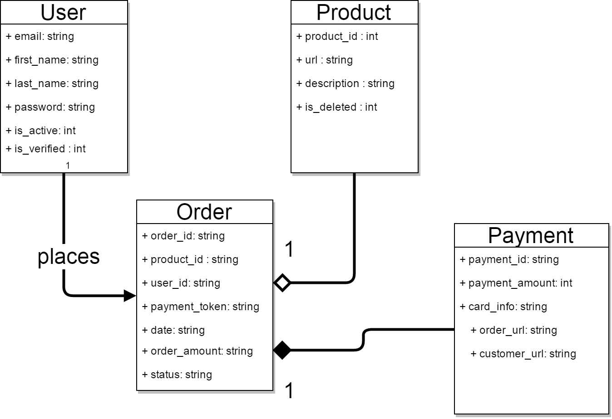
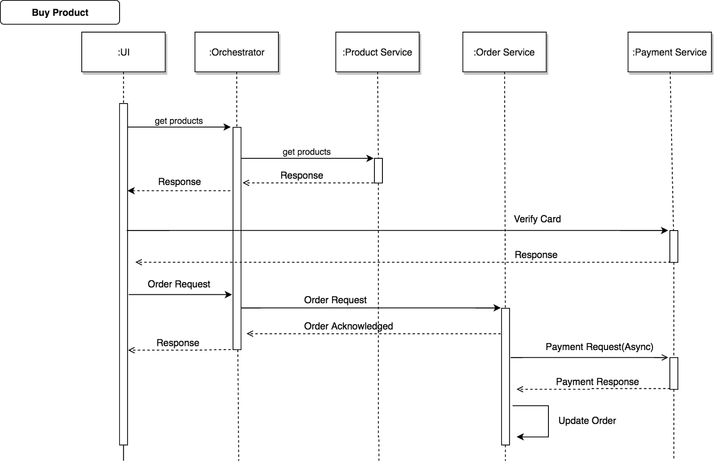

# FrameSeller - Buy Amazing Photos !

### Final Product Design Document and Report

**Team Name:** A Team Has No Name

**Team Members:**

Abhijeet Mehrotra (am4586)  
Akshay Nagpal (an2756)  
Kunal Baweja (kb2896)  
Siddharth Shah (sas2387)  

**DATE**: 27th April, 2017

**S3 Website URL:**
[***https://s3-us-west-2.amazonaws.com/stripe6998/index.html***](https://s3-us-west-2.amazonaws.com/stripe6998/index.html)

***Updates***

-   Added **Slack integration** which notifies a channel on every new user registration

-   Exported **Swagger file** **from API Gateway** (for the integrated API to the various Lambda functions and microservices) with request and response models, paths and HTTP response codes.

-   **Tested all API Endpoints** using Swagger Editor using editor.swagger.io

-   **Deployed API directly** from Swagger file. *(Optional part of assignment)*

-   Included **HATEOAS** style resource URLs in the response object

-   We added **Amazon SQS** (Simple Queue Service) + **SNS** (added in the last assignment) at the following points in the workflow to decouple the interaction between orchestrator and microservices:

    1. *Order-Queue SQS* polled by Orders Lambda. SNS messages published by Order Topic and Payment topic are added in this queue to create order and update payment status of the order respectively.

    2.  *Payment SQS* polled by payment lambda - SNS messages published by order-created topic are added in this queue to process payment with the third-party payment services.

    3.  *Order-created SQS* polled by Order Queue Lambda - SNS messages published by order-created topic are added in this queue to update the record of the order when the order is processed and created in Dynamo.

    4.  *Access-Rule SQS* polled by Access Rule Lambda - SNS messages published by order topic are added in this queue to update the access record for the user. This access record is used to create access rules for Custom Authorizer.

The above modifications are indicated in the following diagrams:

**Implementation Diagram**


**Component Diagram**



**Slack Notifications**




**UPDATE**: 31st March, 2017

**SUMMARY**

-   We added Amazon SNS (Simple Notification Service) at the following points in the workflow to decouple the interaction between orchestrator and microservices:

    1. Between Custom Authorizer and Email Verify Trigger - Custom authorizer publishes to Create-Customer topic which is subscribed by Email Verify Trigger which starts the step function execution.

    2. Between Orchestrator and Orders Microservice - Orchestrator publishes to Order-Update topic which is subscribed by Orders microservice.

    3. Between Orchestrator and Payments adapter (2 way) - Orchestrator publishes to New-Order topic which is subscribed by Payments Adapter. After this, Payments adapter publishes to Payment-Update topic which is in turn subscribed by Orchestrator.

-   Added Step function to carry out user email verification process with below two states:

    1. Verify Customer: Sends an email to the the user with token. User verifies by clicking on the link and the step function turns green.

    2. Customer Verified: Updates customer verification status in database and the step function turns green.

**Step function execution**




*UPDATE : 23th March, 2017*

**SUMMARY**

**S3 Website URL:**
[*https://s3-us-west-2.amazonaws.com/stripe6998/index.html*](https://s3-us-west-2.amazonaws.com/stripe6998/index.html)

**API Gateway Endpoints:**

**/POST**

**Signup:**
[*https://82d0motn04.execute-api.us-east-1.amazonaws.com/prod/authorize/signup/*](https://82d0motn04.execute-api.us-east-1.amazonaws.com/prod/authorize/signup/)
```
{

    “email”: “[*test@address.com*](mailto:test@address.com)”,
    “password”: “test123A@”,
    “firstname”: “First”,
    “lastname”: “Last”,
    “verify\_page”:
    “https://s3-us-west-2.amazonaws.com/stripe6998/verify.html”
}
```
**/POST**

**Login:**
[*https://82d0motn04.execute-api.us-east-1.amazonaws.com/prod/authorize/login/*](https://82d0motn04.execute-api.us-east-1.amazonaws.com/prod/authorize/login/)
```
{

    “email” : “string”,
    “password”: “password”
}
```
**/GET (Authorization: JWT {token})**

**View All Orders:**
[*https://82d0motn04.execute-api.us-east-1.amazonaws.com/prod/orders/*](https://82d0motn04.execute-api.us-east-1.amazonaws.com/prod/orders/)

**View Single Order:**
[*https://82d0motn04.execute-api.us-east-1.amazonaws.com/prod/orders/{orderid}*](https://82d0motn04.execute-api.us-east-1.amazonaws.com/prod/orders/%7Borderid%7D)

**/GET (Authorization: JWT {token})**

**View All Products:**
[*https://82d0motn04.execute-api.us-east-1.amazonaws.com/prod/products/*](https://82d0motn04.execute-api.us-east-1.amazonaws.com/prod/products/)

**View Single Product:**
[*https://82d0motn04.execute-api.us-east-1.amazonaws.com/prod/products/{productid}*](https://82d0motn04.execute-api.us-east-1.amazonaws.com/prod/products/%7Bproductid%7D)

**/GET (Authorization: JWT {token})**

**Verify User:**
[*https://82d0motn04.execute-api.us-east-1.amazonaws.com/prod/authorize/verify/*](https://82d0motn04.execute-api.us-east-1.amazonaws.com/prod/authorize/verify/)

**/POST (Authorization: JWT {token})**

**Purchase Product:**
[*https://82d0motn04.execute-api.us-east-1.amazonaws.com/prod/purchase/*](https://82d0motn04.execute-api.us-east-1.amazonaws.com/prod/purchase/)
```
{
    "product":{
        "url":
        "https://c1.staticflickr.com/1/728/31226388014\_5558604d0f\_k.jpg",
        "price": 100,
        "id": 1,
        "links": \[
            {
                "href": "https://82d0motn04.execute-api.us-east-1.amazonaws.com/prod/products/1",
                "rel": "self"
            }\],
        "description": "Brooklyn Bridge"
    },
    "stripe\_token": "valid\_stripe\_token”
}
```

**Key Points**:

-   Serverless architecture using AWS Lambda and API GateWay

-   Added/Implemented HATEOAS constraint to REST API design

-   Email Verification for new users registered on FrameSeller

-   Custom Authorizer to generate temporary IAM policies for authenticated users

-   Separated microservices for various tasks

**Microservices / Components**:

-   **Custom Authorizer**/Customer Core Service**:

    - Signup request validates user data and creates a user entry in DynamoDB Customer table.

    - Upon user signup triggers email microservice to send validation email

    - For user login request, generates a JWT token with 1 hour validity and returns as a json to user.

    - Validates user requests with JWT tokens to API and generates temporary IAM policies to further invoke the inner components of API such as orders or product microservice.

    - **Email Sending Service**:

        - Triggered by Custom Authorizer to send confirmation emails to new users using SES.

    - **Orchestrator:**

        - Orchestrates complex operations related to placing new order and retrieving details of past orders and payments.

        -   Delegates request to fetch order details to order microservice.

        -   Coordinates order creation and communication with payments microservice upon user request to place a new order.

    -   **Orders Microservice:**

        -   The orders microservice has two functions.

        -   First function is to return orders pertaining to the given user.

        -   The second function to create a order when a user purchases a new product along with its payment status.

        -   It manages the Orders DB.

    -   **Products Microservice:**

        -   It manages the Products DB. It returns a list of all the products. Future implementations would including paging filter.

        -   Individual product details can be retrieved by providing product id.

    -   **Payment Adapter(Stripe):**

        -   Triggered by orchestrator to process payments by interacting with Stripe API.

    -   **Static Client Site Hosting on S3:**

        -   The frontend client is built using HTML, CSS and Javascript and talks with the *FrameSeller* API using Promises and appropriate HTTP requests.

**1. Introduction **

**1.1 Purpose**

The purpose of this document is to show comprehensive architecture
overview and implementation of *FrameSeller* system to buy photos
online. The different diagrams in the document depict different aspects
of the system such as how various components interact with each other,
sequence of interactions that take place inside the system. Thus, it
gives a holistic picture of the entire system. This document show
various architecture decisions taken while initial design of the system.

**1.2 Scope**

*FrameSeller* is a system that allows user to choose their favourite
photos and order printed photo frames for delivery, online. The user
will be able to signup on website using email and login with email and
password. The user can buy photo frames through the website and pay
using their Credit Card / Debit Card. The user will be able to see all
of their past orders along with relevant order details.

**1.3 Definitions, Acronyms, and Abbreviations**

-   *FrameSeller* - web platform to buy photo frames

**1.4 Overview**

The following sections outline the software product in higher detail. We
will start with defining the key features (user stories) that will be
implemented for *FrameSeller*. Next, we will discuss the data model that
we designed for this system. Then we will present the component diagram,
followed by interaction diagrams and future scope, challenges and target
of this project.

**2. User Stories **

-   As a user, I want to register for a new account, so I can start to browse FrameSeller website.

-   For security and authentication purposes a user’s email should be verified thorugh a unique link or token

-   As a user, I want to login to Frame Seller, to see product listings from catalog.

-   As a user, I should be able to change my profile information, so that I can update my information.

-   As a user, if I forget my password, I can find it through email authentication, so that I can use my account. (Todo)

-   As a user, I want to buy products listed on the website.

-   As a user, I want to pay using credit/debit card for the products I purchase.

-   As a user, I want to see my past orders and their payment status.

-   As a user I want to add multiple items to cart so that I can buy them with a single payment. (Todo)

-   As a user I want to return items/ avail refunds. (Todo)

**3. Data Model**



**4. Interaction/Sequence Diagrams**


User Signup Sequence Diagram


User Login Sequence Diagram



Buy Product Sequence Diagram


View Order Sequence Diagram

**5. Future Scope**

1.  Integrate Google Firebase OAuth 2.0 Login / AWS Cognito

2.  Refund / return items

3.  Improve user profile

4.  Shopping cart
