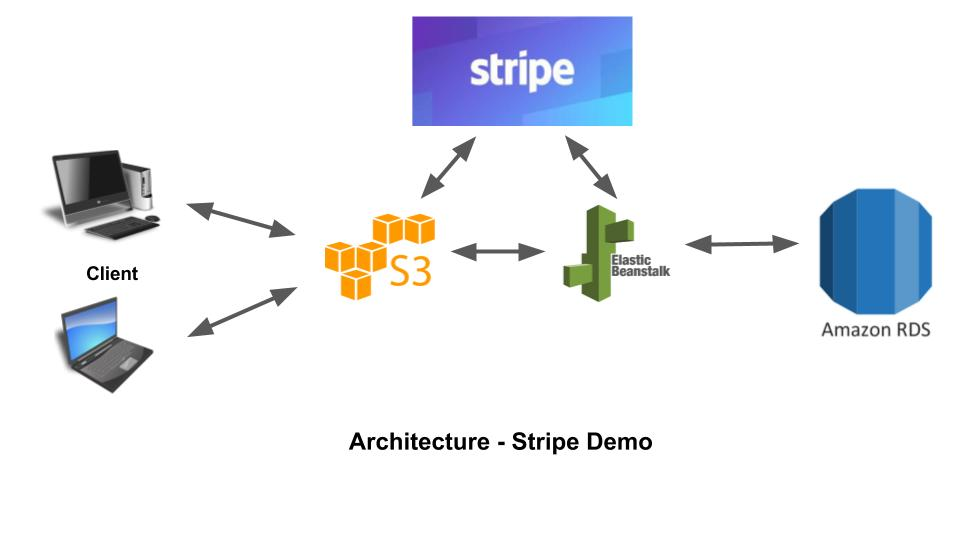
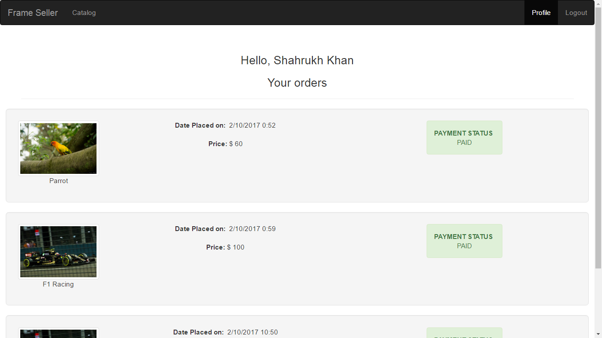
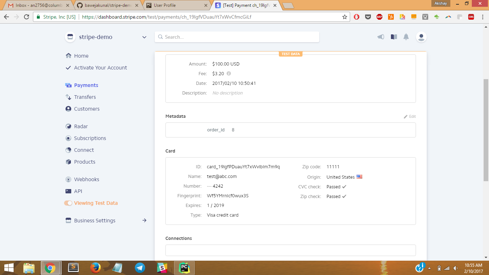

# Stripe Demo

## A Team Has No Name

### Team Members
1. Abhijeet Mehrotra (am4586)
2. Akshay Nagpal (an2756)
3. Kunal Baweja (kb2896)
4. Siddharth Shah (sas2387)

## Architecture


## Tech Stack
1. Python (Django REST Framework)
2. HTML5, CSS, Javascript
3. jQuery, Bootstrap
4. MySQL

## Deployment
1. Front end static files hosted on S3 bucket
2. Database hosted on Amazon RDS
3. Backend server hosted on Elastic Beanstalk (Load Balancer + EC2 instance)

## API endpoints
<dl>
  <dt>POST stripe_demo/api-token-auth/</dt>
  <dd>Login service</dd>
  <dt>POST stripe_demo/signup/</dt>
  <dd>Sign Up service</dd>
  <dt>GET stripe_demo/product/</dt>
  <dd>Fetch product catalog service</dd>
  <dt>GET stripe_demo/order/</dt>
  <dd>Get orders of logged in user</dd>
  <dt>POST stripe_demo/order/</dt>
  <dd>Submit order &amp; stripe token to backend</dd>
</dl>

## Communication with the Stripe Service
### Client Side
Stripe.js was used to integrate payment popup on client side'
### Server Side
Server end uses the Charge API to communicate with the Stripe service and store the order **meta data** on Stripe and the order status in the database
```python
charge = stripe.Charge.create(
            amount=int(product.price*100),
            currency="usd",
            metadata={"order_id": order_id},
            source=stripe_token);
```
## Screenshots






## Further Improvements
1. Use AngularJS in future assignments
2. As suggested by Prof. Donald Ferguson, segregate the microservices further into Order, Payment and User.